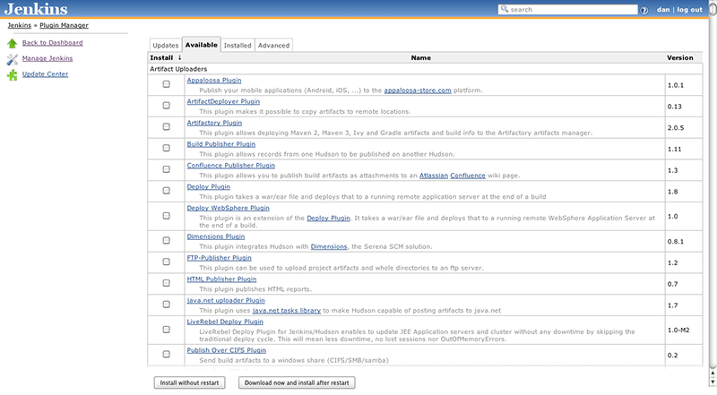

!SLIDE commandline smaller
# Installing on Ubuntu #

## jenkins-ci.org has binaries available for Ubuntu ##

Add jenkins-ci.org's apt key to your system's trusted keys

    $ wget -q -O - http://pkg.jenkins-ci.org/debian/jenkins-ci.org.key | sudo apt-key add -

Add jenkins-ci.org's repository to your apt's sources list

    $ sudo sh -c 'echo deb http://pkg.jenkins-ci.org/debian binary/ > \
    /etc/apt/sources.list.d/jenkins.list'

!SLIDE commandline small
# Installing on Ubuntu #

    $ sudo apt-get update
    $ sudo apt-get install jenkins
Installs Jenkins, creating a jenkins user, and adds a init script at
`/etc/init.d/jenkins`

!SLIDE
# Jenkins Plugins #

There are plugins for both git and GitHub. We'll use both in this
presentation.

Manage your plugins using the Plugin Manager (http://\<jenkins domain>/pluginManager)

!SLIDE center
# Jenkins Plugins #

!SLIDE
# Git Settings #
Navigate to `http://<jenkins domain>/configure`

In the **Git Plugin** section, you'll want to set the **Global Config user.name Value** and **Global Config user.email Value**

!SLIDE
# Shell Settings #
Navigate to `http://<jenkins domain>/configure`

In the **Shell** section, you'll want to set the **Shell executable**

We'll use `/bin/bash` for this presentation

!SLIDE center
# Git & Shell Settings #

