!SLIDE commandline small
# Configuring the jenkins user #
## Installing RVM ##
If you installed jenkins using apt-get, you will already have a
`jenkins` user.

If you plan to use RVM, switch to `jenkins` and install RVM
    $ sudo su - jenkins
    $ bash -s stable < <(curl -s \
    https://raw.github.com/wayneeseguin/rvm/master/binscripts/rvm-installer)

!SLIDE commandline small
# Configuring the jenkins user #
## Trusting `.rvmrc` files ##

To trust the `.rvmrc` file in your project automatically, add the
following to `/var/lib/jenkins/.rvmrc`

`export rvm_trust_rvmrcs_flag=1`

!SLIDE commandline smaller
# Configuring the jenkins user #
## Loading RVM ##

Create the file `/var/lib/jenkins/.bashrc` with the following content

`[ -s "/var/lib/jenkins/.rvm/scripts/rvm" ]  && source "/var/lib/jenkins/.rvm/scripts/rvm"  # This loads RVM into a shell session.`

!SLIDE commandline small
# Configuring the jenkins user #
## Creating ssh keys ##
As the `jenkins` user, run the following
    $ ssh-keygen

Add an SSH Public Key to GitHub using the contents of `/var/lib/jenkins/.ssh/id_rsa.pub` 

!SLIDE 
# Configuring the project #
## Setting up the post-receive hook in GitHub ##
Set a Post-Receive URL on your GitHub project to:

    http://<jenkins domain>/github-webhook/

!SLIDE center

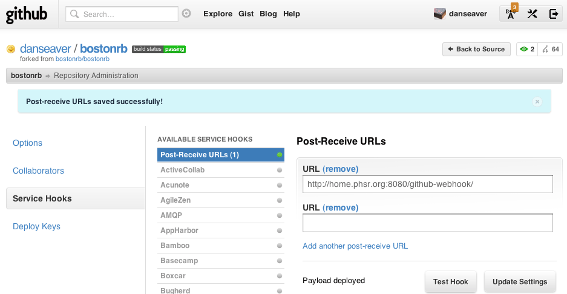

!SLIDE center
# Configuring the project #
## Creating a new job ##
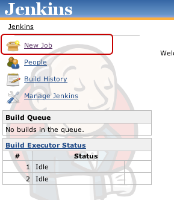

!SLIDE center
# Configuring the project #
## Creating a new job ##
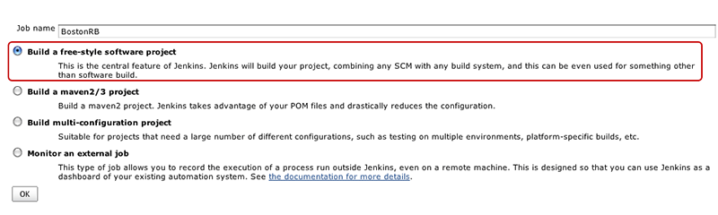

!SLIDE small center
# Configuring the project #
## Configuring source control ##

Set the GitHub Project setting to 

`git@github.com:<username>/<project>.git`

This is necessary for the GitHub post-receive trigger.

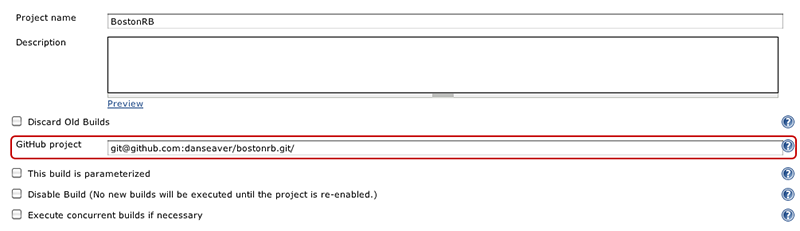

!SLIDE small center
# Configuring the project #
## Configuring source control ##

In the **Source Code Management** section, select **git**, and use  

`git@github.com:<user name>/<project>.git` 

as the Repository URL

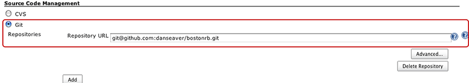

!SLIDE small center
# Configuring the project #
## Configuring the build triggers ##

In the **Build Trigger** section, select **Build when a change is pushed to GitHub**
 
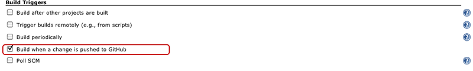

!SLIDE
# What have we done so far? #
Jenkins is now set up to pull a copy of the project whenever a commit is
pushed to the project on GitHub.

We are not running any tests yet.

!SLIDE
# Configuring the build step #
We want to add a build step now.

Click **Add Build Step** and choose **Execute Shell**

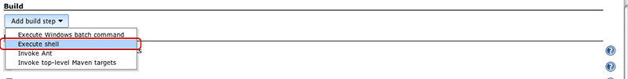

!SLIDE  smaller
# Configuring the build step #
We'll use the following build step:

    source ~/.bashrc         # Loads RVM
    cd .      # Loads the RVM environment set in the .rvmrc file
    cp config/database.yml.example config/database.yml  
    # creates a database.yml
    bundle install           # Installs gems
    rake db:schema:load      # Loads all the database schema
    rake                     # Runs RSpec

!SLIDE center
# Output #
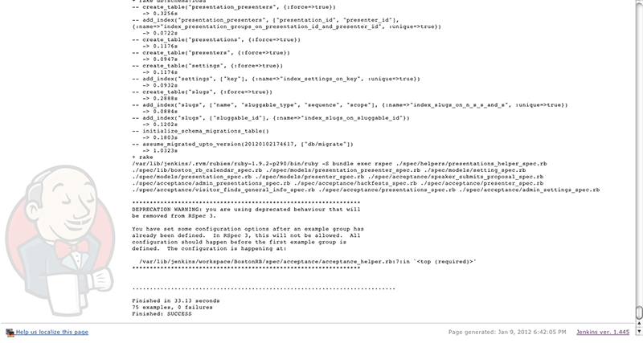

!SLIDE smaller
# Better RSpec Output #
We can take advantage of the fact that Jenkins will serve HTML files in
the workspace and RSpec's HTML formatter

    source ~/.bashrc
    cd .
    rm -rf jenkins && mkdir jenkins
    cp config/database.example.yml config/database.yml
    bundle install
    rake db:schema:load
    SPEC_OPTS="--format html" rake spec > jenkins/rspec.html

!SLIDE center
# Workspace Link #

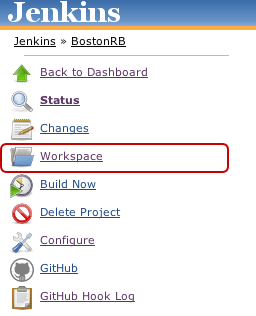

!SLIDE center
# Our Jenkins Folder #

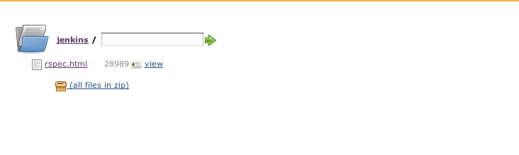

!SLIDE center
# RSpec HTML Output #
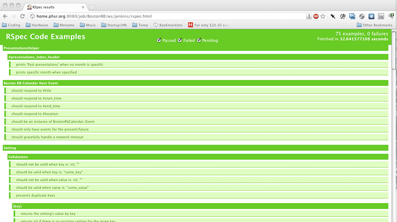

!SLIDE
# Gotchas #

* Make sure gem requirements are installed (postgres lib headers)
* Make sure you install the ruby you use in your `.rvmrc`
* Make sure you have a javascript runtime installed if you are using
  Rails 3.1+

!SLIDE small
# More Information #

## Jenkins ##
[Jenkins](http://jenkins-ci.org)

## My article on using Jenkins with Rails, RVM, RSpec, Cucumber & Capistrano ##
[http://danmcclain.net/blog/2011/11/22/using-jenkins-with-rails/](http://danmcclain.net/blog/2011/11/22/using-jenkins-with-rails/)

## These Slides ##
[http://rails-jenkins.danmcclain.net](http://rails-jenkins.danmcclain.net)
[https://github.com/danmcclain/rails-jenkins](https://github.com/danmcclain/rails-jenkins)
